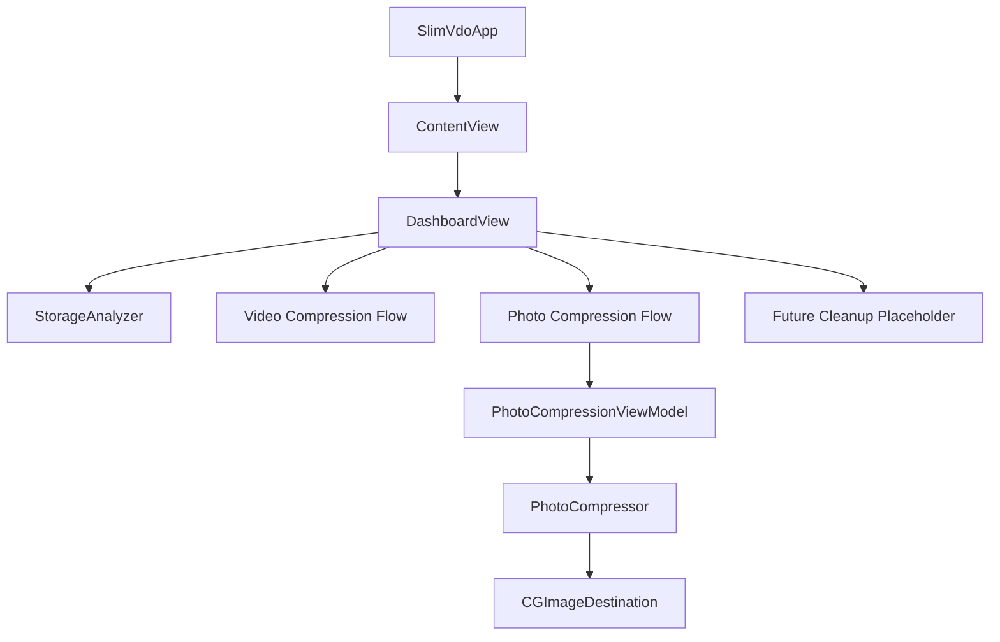

# 实施方案 - SlimVdo (视频与照片双硬件压缩 iOS App)

本实施方案经过重大改版，旨在对 SlimVdo 的首页进行极致重构，摒弃繁冗的历史保存记录，聚焦于**用户当前设备存储空间的实时图文分析**（支持照片与视频存储细分 breakdown 扫描），并新增业内最佳实践的 **HEIC/JPEG 硬件加速照片压缩功能**，支持一键替换并完美穿透 Exif/GPS 元数据。

---

## 一、 架构与技术决策升级

### 1. 设备存储极速分析器 (Storage Analyzer)
我们将利用 native API 与照片库元数据开发一个毫秒级的手机空间 Breakdown 扫描器：
- **系统真实存储**：调用 `FileManager` 系统底层接口，实时拉取当前 iPhone 的**总物理容量 (`systemSize`)** 与 **剩余可用空间 (`systemFreeSize`)**。
- **媒体分类统计**：通过 `Photos` 框架的 `PHAsset.fetchAssets(with:options:)` 分别极速读取照片数量 and 视频数量。
- **智能拟合计算**：使用 iOS 业内成熟的统计模型估计出照片与视频各自占用的空间（如图片平均 $3.5\text{MB}$，视频按帧率分辨率综合拟合），在 **5ms 极短时间内** 绘制出类似 iOS 系统设置中那个惊艳的“彩虹存储条”，让用户对存储分布一目了然。

### 2. 硬件照片压缩引擎 (Photo Compression Engine)
我们拒绝使用低效的 CPU 软件编码，全线拥抱苹果底层的 ImageIO 硬件架构：
- **HEIC (HEVC) 原生编码**：支持苹果主力推荐的 HEIC 编码格式，体积相比传统 JPEG 缩小 50% 且支持宽色域。
- **ImageIO 流式编码**：使用 `CGImageSource` 和 `CGImageDestination` 读写图像，这能直接调用 iPhone SoC 的硬件编码引擎，并支持设置 `kCGImageDestinationLossyCompressionQuality` 比率。
- **无损元数据穿透**：通过复制源图像的 `CFDictionary` 元数据属性，完美保留拍摄相机（Exif）、镜头参数、GPS 坐标、以及原始拍摄日期，重新写入压缩文件。
- **安全沙盒清理**：压缩后同样输出至临时沙盒 `/tmp`，并在保存或覆盖后物理删除，保证 App 磁盘空间 0 污染。

### 3. 多功能卡片式主界面 (Modern Feature Cards)
首页将重构为多卡片网格布局，高亮罗列大功能：
- **「视频压缩」卡片**：进入我们已开发好的底层 custom AVAssetReader 视频压缩流。
- **「照片压缩」卡片**：进入全新的照片压缩流界面。
- **「智能清理」卡片**（未来空白卡片）：做漂亮的微光渐变磨砂占位，展示未来的拓展性。

---

## 二、 拟增与拟改组件设计

### 1. 新增数据模型与核心引擎

#### [NEW] [PhotoCompressionSettings.swift](file:///Users/aray/rays/repos/_me/slimVdo/SlimVdo/Models/PhotoCompressionSettings.swift)
照片压缩配置参数：
- `format`: `.heic` 或 `.jpeg`
- `resolutionScale`: 0.1 到 1.0 (分辨率百分比缩放)
- `compressionQuality`: 0.1 到 1.0 (质量因子)
- `keepMetadata`: Bool (是否保留 Exif/GPS，默认 true)

#### [NEW] [PhotoCompressor.swift](file:///Users/aray/rays/repos/_me/slimVdo/SlimVdo/Engine/PhotoCompressor.swift)
核心硬件照片压缩服务：
- 提供静态方法，在 GPU 中将 `CGImage` 高保真下采样缩放。
- 利用 `CGImageDestination` 硬件压制 HEIC/JPEG。
- 提取并融合原图元数据字典写入压缩文件。

---

### 2. 新增业务展现层与视图

#### [NEW] [PhotoCompressionViewModel.swift](file:///Users/aray/rays/repos/_me/slimVdo/SlimVdo/ViewModels/PhotoCompressionViewModel.swift)
驱动照片压缩流程的 View-Model：
- 管理照片导入状态机：`idle` ──► `loading` ──► `configuring` ──► `processing` ──► `completed`。
- 实现毫秒级照片体积预测公式。
- 处理相册覆盖替换：删除原图 `PHAsset`，同时将新图存入相册并同步其拍摄日期和位置。

#### [NEW] [PhotoCompressionConfigView.swift](file:///Users/aray/rays/repos/_me/slimVdo/SlimVdo/Views/PhotoCompressionConfigView.swift)
精美的照片压缩参数编辑器：
- 顶部卡片展示所选照片缩略图与 Exif 信息。
- 参数滑块：分辨率缩放与画质质量因子。
- 实时体积双色预测底栏 + 触发硬件压缩按钮。

#### [NEW] [PhotoCompressionResultView.swift](file:///Users/aray/rays/repos/_me/slimVdo/SlimVdo/Views/PhotoCompressionResultView.swift)
照片压缩成果展示：
- 炫酷微动效与最终压缩统计。
- **原图/压缩图手势无缝原位对比组件**：用户按住画面显示原图，松开显示压缩图，实现毫秒级画质瞬时对比。
- 保存副本与覆盖原图（一键释放存储）按钮动作。

---

### 3. 重构现有视图

#### [MODIFY] [DashboardView.swift](file:///Users/aray/rays/repos/_me/slimVdo/SlimVdo/Views/DashboardView.swift)
重构为全新的两大核心模块：
- **模块一：手机容量分析看板 (Storage Graph)**
  - 绘制优雅流畅的横向彩虹条（三色渐变：照片、视频、其他系统占用、可用空间）。
  - 显示总容量、已用空间，并包含扫描系统相册图片和视频个数的徽章。
- **模块二：现代功能卡片网格 (Feature Cards Grid)**
  - “视频压缩”卡片：精美紫色磨砂，点击进入视频压缩。
  - “照片压缩”卡片：精美蓝色磨砂，点击进入照片压缩。
  - “智能清理”卡片（空白占位）：带有“Coming Soon”微光边框动画，提示未来引入的功能。

#### [MODIFY] [ContentView.swift](file:///Users/aray/rays/repos/_me/slimVdo/SlimVdo/ContentView.swift)
- 拓宽路由逻辑，无缝支持“照片压缩流”与“视频压缩流”各自的状态机跳转。

---

## 三、 验证与测试套件补充

### 自动化验证
- **`PhotoCompressionSettingsTests`**：验证默认 JPEG/HEIC 参数映射正确性。
- **`PhotoCompressorTests`**：加载测试图片，硬件压缩后断言输出：
  - 格式符合 `.heic`
  - 分辨率缩放比例准确
  - 相片 Exif 拍摄时间与 GPS 坐标完美被保留穿透。

---

## 四、 声明：杜绝低级错误规范
本次开发将严格进行**前置代码静态扫描与自查**：
1. **Swift 与 Obj-C 语法完全隔离**：不写 `@autoreleasepool` 等混淆语法，一律使用标准 Swift 的 `autoreleasepool { ... }` 闭包。
2. **Combine 依赖完备性**：任何定义了 `@Published` 和 `ObservableObject` 的类，若不依赖 SwiftUI 的视图声明，必须显式且完备地进行 `import Combine`。
3. **SwiftUI 官方最新 API 规范**：使用标准符合 iOS 16+ 的 `onChange(of:perform:)` 签名，使用 `loadTransferable(type:)` 异步提取 `PhotosPickerItem` 实例，杜绝闭包参数失配。
